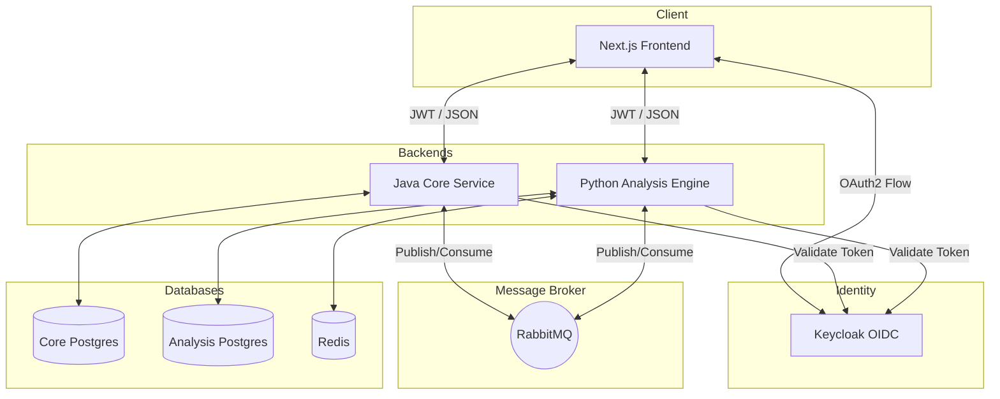

# Fee X-ray


**A production-grade, multi-service SaaS fintech platform** that connects to small business bank and payment processor accounts, automatically detects fees being lost, explains them in plain English, and tracks savings over time.

---

## 🎯 Problem Statement
Small and medium-sized businesses lose thousands of dollars annually to "invisible" fees: zombie software subscriptions, unquestioned payment processor markups, and courtesy bank charges that could easily be waived. Manually auditing statements is tedious and requires domain expertise. Fee X-ray automates this audit, acting as a tireless financial advocate that scans transactions and highlights actionable savings.

## 🚀 Live Demo & Documentation
- **Product Walkthrough**: [Read the Product Guide](docs/PRODUCT.md)
- **Architecture Deep Dive**: [Read the Architecture Guide](docs/ARCHITECTURE.md)
- **Security Posture**: [Read the Security Guide](docs/SECURITY.md)
- **CI/CD & Deployment**: [Read the CI/CD Guide](docs/CI_CD.md)

---

## 🏗️ Architecture Overview

Fee X-ray is built as a polyglot, multi-service architecture utilizing:
1. **Core Service (Java / Spring Boot 3)**: Manages users, organizations, authentication, billing, and entitlements.
2. **Analysis Engine (Python / FastAPI)**: Syncs transaction data via Plaid, runs fee detection rules, and computes analytical insights.
3. **Frontend (Next.js 14 / TypeScript / Tailwind CSS)**: Provides a premium web dashboard for organizations to monitor and resolve fees.



---

## ⚙️ Setup Instructions (Local Development)

The entire stack can be run locally using Docker Compose.

### Prerequisites
- Docker and Docker Compose
- Java 20+ (for Core Service development)
- Python 3.11+ (for Analysis Engine development)
- Node.js 20+ (for Frontend development)

### 1. Start Infrastructure
Start the required databases, message brokers, identity provider, and observability stack:
```bash
cd infra
docker-compose up -d postgres-core postgres-analysis redis rabbitmq keycloak prometheus grafana
```
*(Keycloak will automatically import the `realm-export.json` on startup).*

### 2. Start Core Service (Java)
```bash
cd core-service
./gradlew bootRun
```
*Runs on http://localhost:8081*

### 3. Start Analysis Engine (Python)
```bash
cd analysis-engine
python -m venv venv
source venv/bin/activate
pip install -r requirements.txt
uvicorn app.main:app --reload --port 8000
```
*Runs on http://localhost:8000*

### 4. Start Frontend (Next.js)
```bash
cd frontend
npm install
npm run dev
```
*Runs on http://localhost:3000*

---

## 🚧 Current Limitations & Path to Production

While Fee X-ray is built with production-grade patterns, it is currently a **local development showcase**. To take this live, the following limitations must be addressed:

1. **Cloud Infrastructure Hosting**: We currently rely on local `docker-compose`. For production, the services must be migrated to managed cloud infrastructure (e.g., AWS EKS/ECS, Google Cloud Run, or Azure App Service) with managed databases (RDS/Cloud SQL) and managed brokers (Amazon MQ/ElastiCache).
2. **Plaid Production Access**: The Plaid integration is currently hardcoded to the Plaid `sandbox` environment. To connect real bank accounts, you must apply for Plaid Production access, undergo their security questionnaire, and update the environment variables.
3. **Stripe Production Access**: Stripe is currently running in `test` mode. Real API keys and Webhook secrets must be provisioned and swapped.
4. **Keycloak Cloud**: The local Keycloak container must be replaced by a managed Identity Provider (like Keycloak X on Kubernetes, Auth0, or AWS Cognito) configured with proper SSL/TLS certificates and verified redirect URIs.
5. **Secrets Management**: While `SENTRY_DSN`, `PLAID_SECRET`, and `STRIPE_API_KEY` are read from environment variables, production deployment requires a secure vault (e.g., AWS Secrets Manager, HashiCorp Vault) to inject these securely at runtime.
6. **HTTPS/TLS**: Local development uses HTTP. A reverse proxy (Nginx, Traefik, or an AWS ALB) must be placed in front of the services to terminate SSL.

---

## 📊 Observability

Fee X-ray implements a robust observability stack:
- **Structured JSON Logging**: Both `core-service` and `analysis-engine` output logs in a structured JSON format with a correlated `X-Request-ID`.
- **Metrics**: Exposes `/actuator/prometheus` (Java) and `/metrics` (Python).
- **Grafana Dashboards**: Access Grafana at [http://localhost:3001](http://localhost:3001) (admin/admin) to view the pre-configured "Observability Starter" dashboard.
- **Sentry Integration**: Centralized error tracking across all three tiers.
