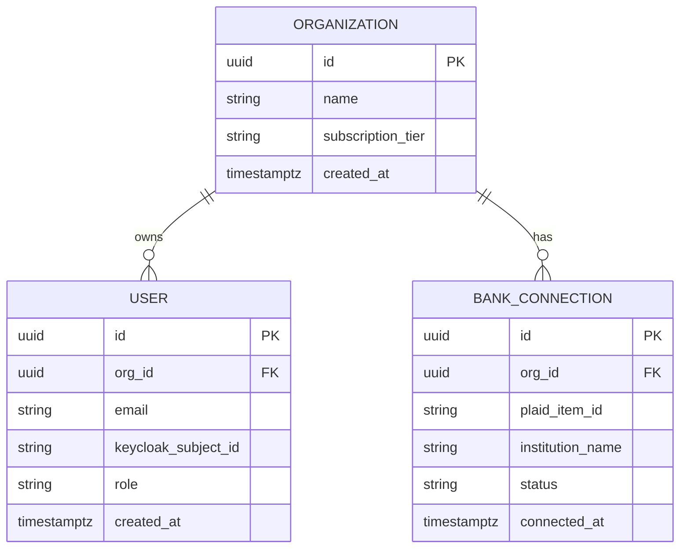
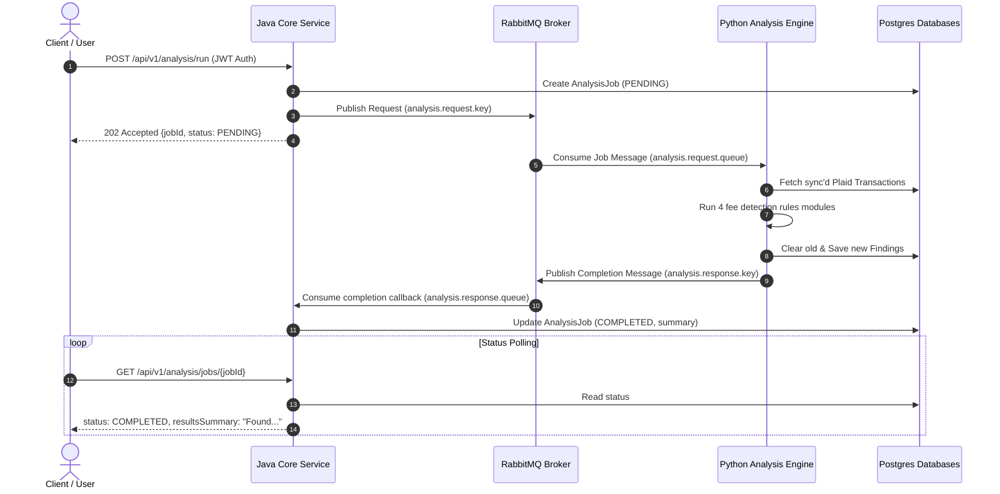

# Fee X-ray

Welcome to Fee X-ray! This is a production-grade SaaS fintech platform that connects to small business bank and payment processor accounts. It automatically detects hidden fees, explains them in plain English, and tracks your savings over time.

## See It In Action

Check out this quick demonstration of how the application works from start to finish. You can see the login flow, bank connections, the findings dashboard, and organization settings.


## Overall Architecture

Fee X-ray uses a modern, multi-service architecture designed for scale and reliability:

1. **Core Service (Java / Spring Boot 3)**: This service acts as the source of truth. It manages users, organizations, authentication, billing, and strict data access rules.
2. **Analysis Engine (Python / FastAPI)**: This service handles the heavy lifting of financial data. It syncs transactions via Plaid and runs our specialized fee detection rules.
3. **Frontend (Next.js 14 / TypeScript / Tailwind CSS)**: This is the user-facing application. It provides a premium, responsive web dashboard for organizations to monitor their savings and resolve fees.

```text
                  ┌─────────────────────────────────┐
                  │            Browser              │
                  │            Next.js 14           │
                  └───────────────┬─────────────────┘
                                  │
                  ┌───────────────┴─────────────────┐
                  │          Keycloak Cloud         │
                  │         (OIDC / Identity)       │
                  └───────────────┬─────────────────┘
                                  │
       ┌──────────────────────────┴──────────────────────────┐
       │                                                     │
       ▼                                                     ▼
┌───────────────────────────────┐                     ┌───────────────────────────────┐
│        Core Service           │                     │        Analysis Engine        │
│    (Spring Boot 3 + Java 21)  │                     │       (FastAPI + Python)      │
└──────────────┬────────────────┘                     └──────────────┬────────────────┘
               │                                                     │
               ▼ (Flyway / JPA)                                      ▼ (SQLAlchemy / Async)
┌───────────────────────────────┐                     ┌───────────────────────────────┐
│       postgres-core           │                     │       postgres-analysis       │
│       (PostgreSQL DB)         │                     │        (PostgreSQL DB)        │
└───────────────────────────────┘                     └───────────────────────────────┘
```

## Why We Chose This Technology Stack

We intentionally divided the backend into two specialized services to get the best of both worlds.

**Java and Spring Boot for the Core Service**
Owning the core domain (like users, billing, and plans) requires absolute correctness and reliability. Spring Security provides a battle-tested foundation for role-based access control and Single Sign-On. On top of that, Java's strong typing and robust compiler catch many errors before the code even reaches production.

**Python and FastAPI for the Analysis Engine**
Banking integration and data analysis require rapid iterations and support for complex calculations. Python's data ecosystem is perfectly suited for parsing high volumes of transactions and running mathematical rules. FastAPI complements this by offering a modern, asynchronous framework for building incredibly fast analytics endpoints.

## Entity Relationship Diagram

Here is a visual representation of how our primary data models relate to each other:



## Clone and Run Locally

If you want to clone this repository, run the application, or build on top of it, please follow these steps.

### Prerequisites

Make sure you have the following installed on your system:
- **Docker and Docker Compose** (required for starting the databases, queues, and auth services)
- **Java 21 Development Kit (JDK)** (required for running or compiling the core service locally)
- **Python 3.11 or higher** (required for running the analysis engine locally)
- **Node.js 18 or higher with npm** (required for running the frontend locally)
- **Git** (for cloning the repository)

### 1. Clone the Repository

Open a terminal and run:

```bash
git clone https://github.com/SatyamPandey07/Fee-X-ray.git
cd Fee-X-ray
```

### 2. Configure Environment Variables

Create environment configuration files for the services if you wish to run them outside Docker. The default configs in the repository are preconfigured to connect automatically when running via Docker Compose.

### 3. Spin up the Core Services via Docker

The simplest way to run the entire application, including the front end, back end, database, queue, and identity services, is by using Docker Compose:

```bash
cd infra
docker-compose up -d --build
```

This starts all of the following services:
- **postgres-core**: Core database on port `5432`
- **postgres-analysis**: Analysis database on port `5433`
- **redis**: Cache and Celery broker on port `6379`
- **rabbitmq**: Message queue on ports `5672` (AMQP) and `15672` (Management Console)
- **keycloak**: Identity provider on port `8080` (preconfigured with realm and test users)
- **core-service**: Java Spring Boot backend on port `8081`
- **analysis-engine**: Python FastAPI engine on port `8000`
- **frontend**: Next.js user interface on port `3000`
- **prometheus**: Scraping metrics on port `9090`
- **grafana**: Dashboard visualization on port `3001`

To view the frontend, navigate to `http://localhost:3000` in your web browser. You can log in using the demo user credentials:
- **Username**: `owner-demo`
- **Password**: `owner123`

To access the Grafana metrics dashboard, open `http://localhost:3001` (Default login: `admin` / `admin`).

### 4. Running Services Individually (for Development)

If you are developing and want to run individual components locally rather than in Docker:

**Start Databases and Queues Only**
```bash
cd infra
docker-compose up -d postgres-core postgres-analysis redis rabbitmq keycloak
```

**Run the Core Service (Java)**
```bash
cd core-service
./gradlew bootRun
```

**Run the Analysis Engine (Python)**
```bash
cd analysis-engine
python -m venv venv
source venv/bin/activate  # On Windows use `venv\Scripts\activate`
pip install -r requirements.txt
uvicorn app.main:app --reload
```

**Run the Frontend (Next.js)**
```bash
cd frontend
npm install
npm run dev
```

### 5. Running Tests

To run the automated tests for each service:

**Java Core Service Tests**
```bash
cd core-service
./gradlew test
```

**Python Analysis Engine Tests**
```bash
cd analysis-engine
pytest
```

**Frontend Lints & Type Checks**
```bash
cd frontend
npm run lint
```

## Authentication and Security

Fee X-ray secures user accounts using OpenID Connect orchestrated by Keycloak.

When a user logs in, the Next.js frontend intercepts the request and securely saves the token in an `httpOnly` cookie. The Java Core Service then validates these tokens on every API request. 

We also built an auto-provisioning system. On a user's first successful login, our system checks if they exist in the database. If they do not exist yet, we automatically create a new Organization for them and grant them the Owner role. 

Data privacy is our top priority. We enforce strict tenant isolation rules. All database queries and modifications are strictly scoped to the tenant's organization context. Owners can manage the organization, while Members have read-only access.

## Billing Integration

We built a seamless, multi-tiered billing system using Stripe Subscriptions.

Users start on a Free plan, which is limited to exactly one active bank connection. If they want to unlock unlimited bank connections and scheduled hourly fee analyses, they can upgrade to the Pro plan for a flat monthly fee.

Users are redirected to a secure Stripe-hosted Checkout session to subscribe. We listen to secure webhook events from Stripe to automatically upgrade or downgrade organizations in our database in real time.

## Bank Connections

Fee X-ray connects to user bank accounts via Plaid to securely synchronize financial transactions. 

Plaid access tokens represent direct access to a business's banking details, so we treat them with enterprise-grade security protocols. Access tokens are never stored in plain-text. They are encrypted using AES-128 cipher prior to insertion into the database, and the encryption keys are rotated dynamically.

## How Fee Detection Works

At the heart of Fee X-ray is a modular rules engine that evaluates your synchronized transaction data to flag potential savings.

Our engine looks for several common issues:
1. **Processor Rate Benchmarking**: We compare card processing fees against industry standard interchange rates. If your effective fee rate is too high, we flag it.
2. **Zombie Subscription Detection**: We identify recurring payments to software vendors that have had no user activity recorded in the past 90 days.
3. **Unwaived Bank Fee Detection**: We detect typical commercial bank service charges (like overdraft or wire fees) that can often be waived by simply calling your bank.
4. **Undisputed Chargeback Detection**: We find customer payment disputes that lack a matching reversal or win, alerting you before the dispute window expires.

## Service Integration and Orchestration

The Java Core Service and Python Analysis Engine communicate using a decoupled asynchronous messaging model powered by RabbitMQ. 

Here is exactly how a user request flows through the system:

1. The user logs in and clicks the button to run an analysis.
2. The Java Core Service writes a local tracking record and marks it as pending.
3. The Core Service publishes a job message to RabbitMQ.
4. The Python Analysis Engine has a concurrent listener thread that picks up the job.
5. The Python daemon runs the rules engine, analyzes the transaction records, and saves the new findings.
6. Once finished, the Python daemon publishes a completion status report back to RabbitMQ.
7. The Java Core Service consumes the completion callback and updates the job status in the database.
8. The frontend polls the status and renders the results to the user.



## Observability

Fee X-ray implements a robust observability stack out of the box. Both backend services output logs in a structured JSON format with a correlated Request ID to easily trace requests across microservice boundaries. 

We also collect detailed metrics. The Java service exposes Prometheus metrics via Spring Actuator, and the Python service exposes them via a custom metrics endpoint. You can view all of this data in a pre-configured Grafana dashboard that automatically loads when you start the application.
