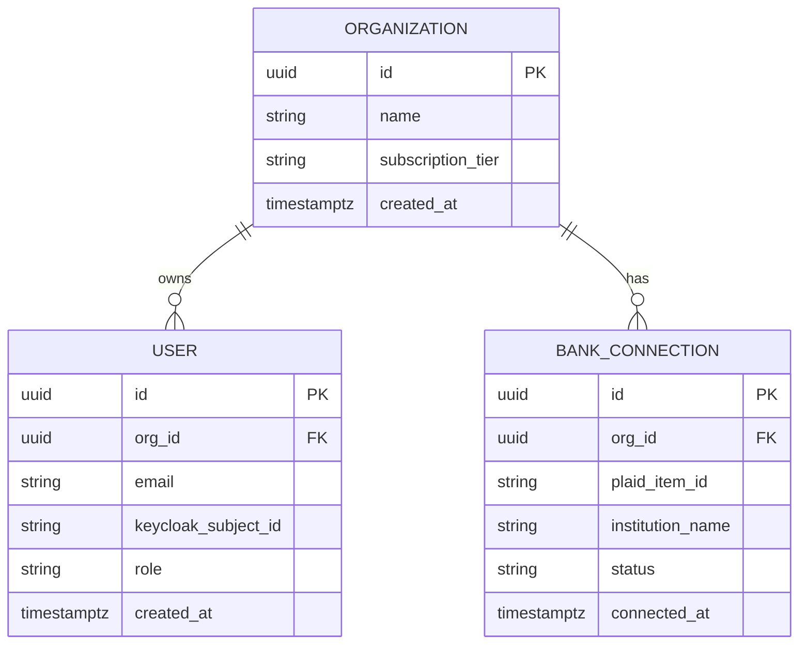
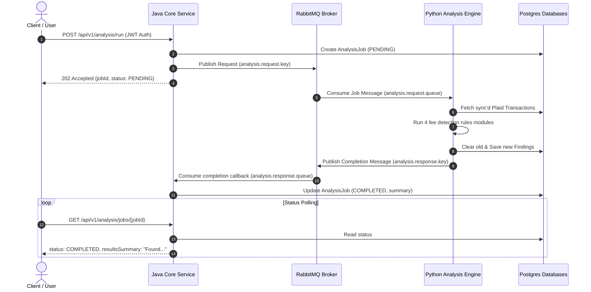

# Fee X-ray

A production-grade, multi-service SaaS fintech platform that connects to small business bank and payment processor accounts, automatically detects fees being lost, explains them in plain English, and tracks savings over time.

---

## Overall Architecture

Fee X-ray is built as a polyglot, multi-service architecture utilizing:
1. **Core Service (Java / Spring Boot 3)**: Manages users, organizations, authentication, billing, and entitlements.
2. **Analysis Engine (Python / FastAPI)**: Syncs transaction data via Plaid, runs fee detection rules, and computes analytical insights.
3. **Frontend (Next.js 14 / TypeScript / Tailwind CSS)**: Provides a premium web dashboard for organizations to monitor and resolve fees.

```
                  ┌─────────────────────────────────┐
                  │            Browser              │
                  │            Next.js 14           │
                  └───────────────┬─────────────────┘
                                  │
                  ┌───────────────┴─────────────────┐
                  │          Keycloak Cloud         │
                  │         (OIDC / Identity)       │
                  └───────────────┬─────────────────┘
                                  │
       ┌──────────────────────────┴──────────────────────────┐
       │                                                     │
       ▼                                                     ▼
┌───────────────────────────────┐                     ┌───────────────────────────────┐
│        Core Service           │                     │        Analysis Engine        │
│    (Spring Boot 3 + Java 21)  │                     │       (FastAPI + Python)      │
└──────────────┬────────────────┘                     └──────────────┬────────────────┘
               │                                                     │
               ▼ (Flyway / JPA)                                      ▼ (SQLAlchemy / Async)
┌───────────────────────────────┐                     ┌───────────────────────────────┐
│       postgres-core           │                     │       postgres-analysis       │
│       (PostgreSQL DB)         │                     │        (PostgreSQL DB)        │
└───────────────────────────────┘                     └───────────────────────────────┘
```

---

## Why Two Backend Languages?

We intentionally divide the backend into two specialized services:

- **Java (Spring Boot) for the Core Service**:
  - Owning the core domain (users, orgs, billing, and plans) requires absolute, provable correctness and reliability.
  - Spring Security provides production-grade, battle-tested implementations of role-based access control and OpenID Connect (OIDC).
  - Strong typing and a robust compiler catch entire classes of errors before code reaches production.

- **Python (FastAPI) for the Analysis Engine**:
  - Banking integration and data analysis require rapid iterations and support for complex calculations.
  - Python's data ecosystem (Pandas, NumPy) is perfectly suited for high-volume transaction parsing and running mathematical rules.
  - FastAPI offers an asynchronous, modern, and high-performance framework for building fast I/O analytics endpoints.

---

## Entity Relationship Diagram



---

## Authentication & SSO (Keycloak Integration)

Fee X-ray implements authentication and Single Sign-On (SSO) using OpenID Connect (OIDC) orchestrated by Keycloak.

### OIDC Flow
- **Next.js Frontend**: Intercepts requests, starts the auth flow, handles the auth code callback, and securely saves the OIDC token in an `httpOnly` secure cookie.
- **Java Core Service**: Validates JWT signatures using Spring Security's OAuth2 Resource Server.

### Auto-Provisioning
On first successful OIDC login, `UserOnboardingFilter` intercepts the request:
1. Validates the Keycloak subject ID (`sub` claim).
2. If the user does not exist in the database, it automatically creates a new `Organization` (e.g., `"${email}'s Org"`) and registers the user with the role `OWNER`.

### Tenant Isolation & Roles
- **OWNER**: Can read, update, and manage the organization and its member users.
- **MEMBER**: Has read-only permissions for organization data.
- All database queries and modifications are strictly scoped to the tenant organization context to ensure complete tenant boundaries.

### Enterprise SAML SSO Integration
To hook up an enterprise SAML Identity Provider (IdP) in Keycloak:
1. In the Keycloak admin console, go to **Identity Providers**.
2. Select **SAML 2.0**.
3. Import the metadata XML from your enterprise IdP (e.g., Okta, Azure AD).
4. Configure Mapper rules to map user SAML groups to Keycloak roles (`OWNER`/`MEMBER`).

---

---

## Billing & Stripe Integration

Fee X-ray supports multi-tiered billing using Stripe Subscriptions in test mode.

### Plan Tiers
- **FREE**: Limited to exactly 1 active bank connection. Auto-analysis runs are disabled.
- **PRO**: Unlimited bank connections and scheduled hourly fee analyses. Priced at $29/month.

### APIs & Flow
- **Stripe Checkout**: Users are redirected to a secure Stripe-hosted Checkout session via `POST /api/v1/billing/checkout` to subscribe to the Pro tier.
- **Stripe Customer Portal**: Active subscribers manage their subscription plan, billing statements, and credit cards via `POST /api/v1/billing/portal`.
- **Stripe Webhooks**: Listens to secure webhook events on `POST /api/v1/billing/webhook` (no JWT required). It verifies webhook signatures using `Stripe-Signature` and automatically upgrades or downgrades organizations in the database upon events:
  - `checkout.session.completed` -> Upgrades Organization to PRO / active.
  - `customer.subscription.deleted` -> Downgrades Organization to FREE / canceled.
  - `customer.subscription.updated` -> Updates subscription status.

### Entitlement Checks
Our `EntitlementService` verifies connection limits. If a FREE tier organization attempts to link a second bank connection, the request is rejected with `EntitlementLimitExceededException` (HTTP 403 Forbidden).

---

## Bank Connections & Security (Plaid Integration)

Fee X-ray connects to user bank accounts via Plaid to securely synchronize financial transactions.

### Plaid Token Security
Plaid access tokens represent direct access to a business's banking details and are treated with enterprise-grade security protocols:
- **Encryption at Rest**: Access tokens are never stored in plain-text. They are encrypted using `cryptography`'s AES-128 Fernet cipher prior to SQL insertion.
- **Key Rotation**: The encryption key is sourced dynamically from the `ENCRYPTION_KEY` environment variable.

### API Endpoints (Python Analysis Engine)
- `POST /api/v1/plaid/link-token`: Creates a Plaid Link Token configured for the sandbox environment to initialize the Plaid SDK on the frontend.
- `POST /api/v1/plaid/exchange-token`: Receives `public_token` and exchanges it for `access_token` and `item_id`. This endpoint:
  1. Validates the user's OIDC JWT.
  2. Enforces organization boundaries (verifying user's token `org_id` matches the request body `org_id` to block cross-organization tampering).
  3. Saves the encrypted access token in the `plaid_connections` table.
  4. Triggers an automatic sandbox transaction sync, loading transactions into the `transactions` table.

---

## How Fee Detection Works

Fee X-ray relies on a modular rules engine to evaluate sync'd transaction data, flagging potential savings.

### Modular Rules
1. **Processor Rate Benchmarking**: Compares card-processing fees (Stripe, PayPal, etc.) against interchange-plus benchmarks. If the effective fee rate exceeds 3.5%, it calculates the annual excess cost and flags it.
2. **Zombie Subscription Detection**: Identifies recurring transactions to SaaS merchants (e.g. Zoom, Adobe, Slack, Dropbox) that have had no user utility or activity recorded in the past 90+ days.
3. **Unwaived Bank Fee Detection**: Detects typical commercial bank service charges (overdraft, wire fees, monthly maintenance) that can commonly be waived by the financial institution upon courtesy request.
4. **Undisputed Chargeback Detection**: Identifies customer payment disputes/chargebacks that lack matching reversal or dispute wins. It alerts the user to respond before the dispute window expires.

### Rules Engine
The Rules Engine aggregates findings from each detector, cleanses past results for the tenant organization, persists them in the `findings` table, and returns them sorted descending by `dollar_impact`.

### Async Background Tasks (Celery + Redis)
To avoid blocking request threads, transaction analysis runs asynchronously in a Celery background worker:
- **Broker**: Redis (`redis://localhost:6379/0`)
- **Task**: `app.tasks.analyze_org_fees(org_id)`

---

## Service Integration & RabbitMQ Orchestration

Fee X-ray connects the Java Core Service and Python Analysis Engine using a decoupled asynchronous messaging model powered by RabbitMQ.

### Communication Flow & Sequence Diagram
1. The user logs in and triggers an analysis run via frontend `POST /api/v1/analysis/run`.
2. Java Core Service writes a local `AnalysisJob` tracking record in state `PENDING`.
3. Java Core Service publishes a job message containing `{jobId, orgId}` to RabbitMQ exchange `analysis.exchange` (routing key `analysis.request.key`).
4. Python Analysis Engine has a concurrent listener thread that consumes from queue `analysis.request.queue`.
5. Python daemon receives the job, invokes the Rules Engine, analyzes transaction records, and saves the new findings.
6. Python daemon publishes a completion status report containing `{jobId, orgId, status: "COMPLETED", summary}` back to RabbitMQ exchange (routing key `analysis.response.key`).
7. Java Core Service consumes from queue `analysis.response.queue` via `@RabbitListener` and updates the job status and summary.
8. Frontend polls `GET /api/v1/analysis/jobs/{jobId}` to check status and render findings to the user.



---

## Roadmap & Upcoming Phases

- **Phase 1: Monorepo Scaffolding & Orchestration** [COMPLETED]
  - Scaffolding minimal Java/Spring, Python/FastAPI, and Next.js projects.
  - Setting up Docker Compose for local orchestration.
- **Phase 2: Core Domain Model & Databases** [COMPLETED]
  - Database schema configuration with Flyway (Core) and Alembic (Analysis).
  - Provisioning of standard entities (Organization, User, Entitlement) and repositories.
- **Phase 3: SSO Authentication & Role-Based Access Control** [COMPLETED]
  - Integrated Keycloak realm and OIDC client scopes.
  - Secured Spring Boot Core Service with OAuth2 Resource Server.
  - Added dynamic user onboarding and auto-provisioning.
- **Phase 4: Stripe Billing & Subscription Entitlements** [COMPLETED]
  - Multi-tier billing (Free vs Pro) using Stripe Subscriptions.
  - Webhook handlers with mandatory signature verification.
  - Connection limit entitlement gates and Billing dashboard UI.
- **Phase 5: Bank Connection & Analysis Engine** [COMPLETED]
  - Plaid sandbox integration and transaction sync.
  - Plaid token encryption at rest.
  - OIDC JWT access verification and cross-tenant boundaries.
- **Phase 6: Fee Detection Engine** [COMPLETED]
  - Processor rate benchmarking, zombie subscription detection, unwaived bank fees, and undisputed chargeback rules.
  - Celery background worker running Redis queue.
- **Phase 7: Service Integration & Asynchronous Messaging** [COMPLETED]
  - Decoupled messaging over RabbitMQ exchanges, request/response queues, and routing keys.
  - Core service status polling endpoints and Python daemon threads.
- **Phase 8: Premium Dashboard UI**
  - Building the Next.js frontend with full support for user roles, connected accounts, and savings visualization.
- **Phase 9: Observability, Metrics & Sentry**
  - Setting up Prometheus metrics collection, Grafana dashboards, and Sentry tracking.
