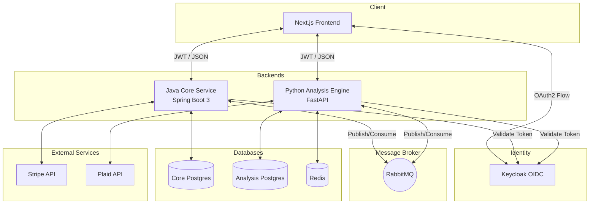

# Fee X-ray System Architecture

## 1. System Overview & Technology Rationale
Fee X-ray employs a polyglot microservice architecture designed to strictly enforce domain boundaries while maximizing developer velocity in specialized areas.

### Next.js 14 Frontend
- **Why**: React with Server Components (Next.js) provides a snappy, responsive, and SEO-friendly user experience. Tailwind CSS allows for rapid, premium styling.
- **Role**: Serves the user interface, manages the client-side OIDC auth flow, and communicates securely with the backend APIs.

### Java (Spring Boot 3) Core Service
- **Why**: The core domain (Users, Organizations, Entitlements, Billing) requires absolute reliability and strict contract enforcement. Java’s robust type system and Spring Security’s battle-tested OAuth2 implementation make it the ideal choice for managing state and access.
- **Role**: Handles all billing (Stripe), identity management (Keycloak validation), and orchestrates long-running tasks.

### Python (FastAPI) Analysis Engine
- **Why**: Python dominates the data science and analytics ecosystem. Writing complex mathematical rules for transaction analysis is significantly faster and more expressive in Python than in Java. FastAPI offers high-performance asynchronous I/O.
- **Role**: Connects to Plaid, syncs financial transactions, and executes the fee detection rules engine.

---

## 2. Full System Diagram

---

## 3. Data Model

The application employs the Database-per-Service pattern to prevent tight coupling.

### Core Service Database (`feexray_core`)
- **Organizations**: `id`, `name`, `subscription_tier`, `created_at`
- **Users**: `id`, `org_id` (FK), `email`, `keycloak_subject_id`, `role`
- **Analysis Jobs**: `id`, `org_id`, `status`, `summary`

### Analysis Engine Database (`feexray_analysis`)
- **Plaid Connections**: `id`, `org_id`, `plaid_item_id`, `encrypted_access_token`
- **Transactions**: `id`, `connection_id`, `amount`, `merchant_name`, `date`
- **Findings**: `id`, `org_id`, `transaction_id`, `rule_name`, `dollar_impact`, `description`

---

## 4. Security Model

Security is baked into the architecture at every layer:

- **Identity**: Keycloak acts as the sole Identity Provider. All endpoints validate cryptographically signed JWTs via an OAuth2 Resource Server configuration.
- **Tenant Isolation**: Every database query explicitly filters by `org_id` parsed securely from the validated JWT claims.
- **Encryption**: Plaid access tokens are encrypted at rest using AES-128 Fernet.
- **Rate Limiting**: Tier-based rate limiting via Bucket4j (Java) and Slowapi (Python).
- **Vulnerability Management**: Trivy container scanning in CI, CodeQL static analysis, and Dependabot automated updates.
- **Audit Logging**: Sensitive actions (bank connections, billing changes) are written to structured JSON logs injected with `X-Request-ID` correlation identifiers.
